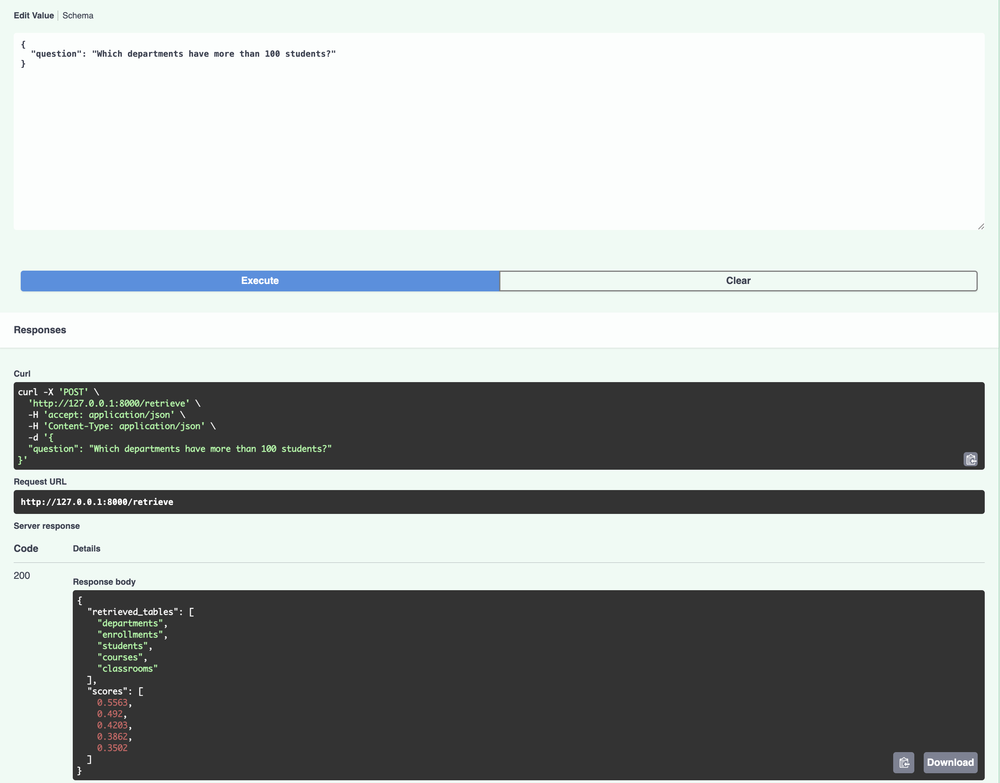
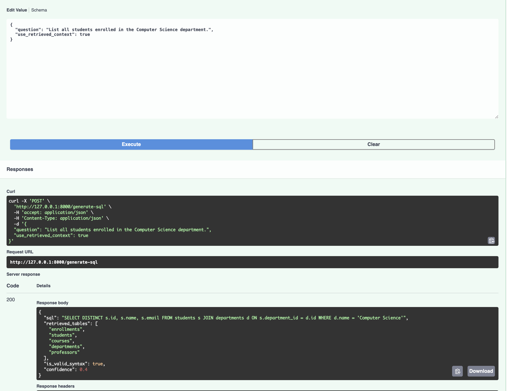
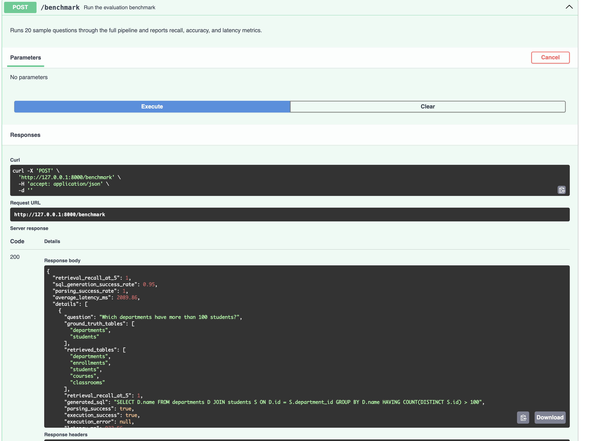

# Enterprise Text-to-SQL API

## Overview

Enterprise Text-to-SQL API is a FastAPI-based microservice that converts natural language questions into executable SQL queries.

The system uses semantic schema retrieval, Large Language Models (LLMs), SQL validation, and database execution to provide an end-to-end Text-to-SQL pipeline similar to those used in modern enterprise business intelligence platforms.

Example:

**User Question**

```text
List all students enrolled in the Computer Science department.
```

**Generated SQL**

```sql
SELECT s.name, s.email
FROM students s
INNER JOIN departments d
ON s.department_id = d.id
WHERE d.name = 'Computer Science';
```

---

## Features

### Semantic Schema Retrieval

* Uses Sentence Transformers to create schema embeddings.
* Uses FAISS vector search for efficient table retrieval.
* Retrieves the most relevant tables for a given natural language question.

### LLM-Powered SQL Generation

* Uses Groq-hosted LLMs.
* Generates SQL from natural language questions.
* Incorporates retrieved schema context into prompts.

### SQL Validation

* Validates generated SQL before execution.
* Blocks unsafe statements.
* Allows only read-only SELECT operations.

### Database Execution

* Executes validated SQL against SQLite.
* Returns query results in JSON format.

### Benchmarking

* Evaluates retrieval and SQL generation performance.
* Measures latency and success rates.
* Generates summary metrics.

### API Documentation

* Interactive Swagger UI.
* Automatic OpenAPI specification generation.

---

## System Architecture

```text
User Question
      │
      ▼
Schema Retrieval Layer
      │
      ▼
Prompt Builder
      │
      ▼
Groq LLM
      │
      ▼
SQL Validation
      │
      ▼
SQLite Execution
      │
      ▼
Response + Metrics
```

---

## Project Structure

```text
enterprise-text-to-sql/
│
├── app/
│   │
│   ├── api/
│   │   └── routes.py
│   │
│   ├── retrieval/
│   │   └── retrieve_tables.py
│   │
│   ├── llm/
│   │   └── generate_sql.py
│   │
│   ├── validation/
│   │   └── validate_sql.py
│   │
│   ├── database/
│   │   └── run_query.py
│   │
│   ├── benchmark/
│   │   └── benchmark.py
│   │
│   ├── schemas/
│   │   └── models.py
│   │
│   ├── utils/
│   │   └── logger.py
│   │
│   └── main.py
│
├── logs/
├── .env
├── requirements.txt
└── README.md
```

---

## Technology Stack

| Component     | Technology              |
| ------------- | ----------------------- |
| Backend API   | FastAPI                 |
| LLM Provider  | Groq                    |
| LLM Model     | Llama 3.3 70B Versatile |
| Embeddings    | Sentence Transformers   |
| Vector Search | FAISS                   |
| Database      | SQLite                  |
| Validation    | sqlparse                |
| Data Models   | Pydantic                |
| Documentation | Swagger UI              |

---

## API Endpoints

### 1. Retrieve Relevant Tables

**Endpoint**

```http
POST /retrieve
```

**Request**

```json
{
  "question": "Which departments have more than 100 students?"
}
```

**Response**

```json
{
  "retrieved_tables": [
    "departments",
    "students",
    "enrollments"
  ],
  "scores": [
    0.92,
    0.87,
    0.84
  ]
}
```

---

### 2. Generate SQL

**Endpoint**

```http
POST /generate-sql
```

**Request**

```json
{
  "question": "List all students enrolled in the Computer Science department.",
  "use_retrieved_context": true
}
```

**Response**

```json
{
  "sql": "SELECT ...",
  "retrieved_tables": [
    "students",
    "departments"
  ],
  "is_valid_syntax": true,
  "confidence": 0.85
}
```

---

### 3. Execute SQL

**Endpoint**

```http
POST /execute
```

**Request**

```json
{
  "sql": "SELECT * FROM students"
}
```

**Response**

```json
{
  "rows": [...]
}
```

---

### 4. Benchmark

**Endpoint**

```http
POST /benchmark
```

**Response**

```json
{
  "metrics": {
    "retrieval_recall_at_5": 0.88,
    "parsing_success_rate": 0.96,
    "sql_generation_success_rate": 0.81,
    "average_latency_ms": 850
  }
}
```

---

## Installation

### Clone Repository

```bash
git clone <repository-url>
cd enterprise-text-to-sql
```

### Create Virtual Environment

```bash
python -m venv venv
```

### Activate Virtual Environment

Mac/Linux

```bash
source venv/bin/activate
```

Windows

```bash
venv\Scripts\activate
```

### Install Dependencies

```bash
pip install -r requirements.txt
```

---

## Environment Variables

Create a `.env` file.

```env
GROQ_API_KEY=your_groq_api_key
```

---

## Running the Application

Start the FastAPI server:

```bash
uvicorn app.main:app --reload
```

Open:

```text
http://127.0.0.1:8000/docs
```

to access Swagger UI.

---

## Benchmarking Methodology

The benchmark module evaluates:

* Retrieval Recall@5
* SQL Generation Success Rate
* SQL Parsing Success Rate
* Average Response Latency

These metrics provide insight into both retrieval quality and SQL generation accuracy.

---

## Security Measures

The validation layer blocks:

```sql
DROP
DELETE
UPDATE
INSERT
ALTER
TRUNCATE
```

Only safe read-only SQL queries are allowed.

---

## Logging

The application logs:

* Incoming questions
* Retrieved schema tables
* Generated SQL queries
* Execution results
* Error traces

Log file:

```text
logs/app.log
```

---

## Future Improvements

* PostgreSQL support
* Multi-database routing
* Hybrid retrieval (BM25 + FAISS)
* Fine-tuned Text-to-SQL models
* Query optimization engine
* Execution-based SQL verification
* Retrieval evaluation on Beaver benchmark

---

## Learning Outcomes

This project demonstrates:

* FastAPI development
* Semantic search systems
* Vector databases and embeddings
* LLM integration
* Prompt engineering
* SQL generation pipelines
* Database systems
* Enterprise AI application design

---

## Author

R Sai Praneeth Sharma

B.Tech Computer Science Engineering (AI & ML)

Ajeenkya DY Patil University | Newton School of Technology

# Screenshots

## Retrieve Endpoint



---

## Generate SQL Endpoint



---

## Benchmark Endpoint



---
